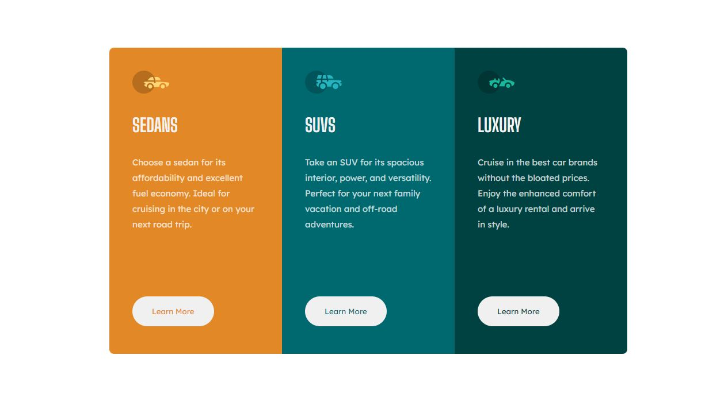

# Frontend Mentor - 3-column preview card component solution

This is a solution to the [3-column preview card component challenge on Frontend Mentor](https://www.frontendmentor.io/challenges/3column-preview-card-component-pH92eAR2-). Frontend Mentor challenges help you improve your coding skills by building realistic projects. 

### The challenge

Users should be able to:

- View the optimal layout depending on their device's screen size
- See hover states for interactive elements

### Screenshot

### Links

- [My Solution](https://github.com/Aditi002-holo/3-col-preview-card)
- [Solution URL](https://aditi002-holo.github.io/3-col-preview-card/)

### Built with

- HTML5
- CSS
- Flexbox
- CSS Grid
- Mobile First Approach

## Author

- Frontend Mentor - [@Aditiholo-002](https://www.frontendmentor.io/profile/Aditi002-holo)
- Twitter - [@aditiintechk](https://twitter.com/aditiintechk)